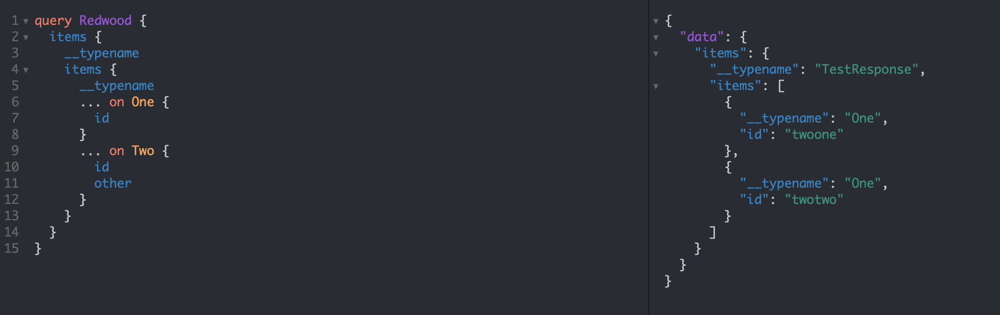

# GraphQL issue with two types of same structure

For the following type definitions:

```graphql
type One {
  id: String!
  other: String
}

type Two {
  id: String!
  other: String
}

union All = One | Two
```

The type will always come out as `__typename: "One"`

```js
{
  __typename: 'Two',
  id: 'twoone',
  other: 'other',
}
```



This happens regardless of what `__typename` is set to or any typescript types.
